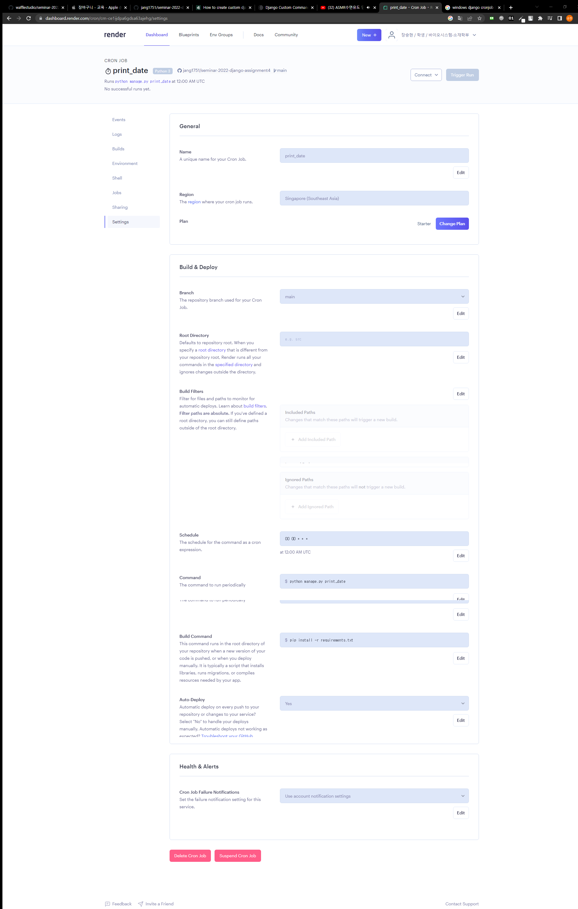

# Assignment 4

## problem 1: render.com을 이용한 production 배포

paas 플랫폼인 render.com을 이용해 django project를 배포합니다.

- 'Hello Seunghyun!'을 출력하는 사이트 배포
- url: https://django-render-9dq3.onrender.com

## problem 2: render.com을 이용한 custom management command cron job

custom management command를 작성한 후, 이를 render.com의 cronjob을 이용해 scheduled로 실행합니다.

- 현재 날짜를 매일 자정에 출력하는 custom management command를 작성

